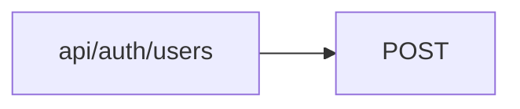
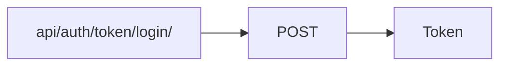

# praktikum_new_diplom

[](https://python.org)
[](https://www.djangoproject.com/)
[](https://www.django-rest-framework.org/)


# About project
You can play with project on https://youaremyproject.ddns.net/
The project is a site Foodgram (or your personal "Product assistant")
You can publicate recipes, subscribe on publications other users, add recipes that you like in favorites and download list of ingredients that you put in your cart

Stack: Django, Django REST framework, PostgreSQL

## Setting up and starting backend

<hr/>
<details close>
<summary><h4 style="display: inline">WINDOWS <h3 style="display: inline">▶️</h3></h4></summary>

_Clone the project_

```shell
git clone git@github.com:Siktorovich/foodgram-project-react.git
```

_Move to backend folder_

```shell
cd .\backend\
```

_Create local environment_

```shell
python -m venv venv
```

_Activate venv_

```shell
venv\Scripts\activate           # PowerShell
```

```shell
source venv/Scripts/activate    # Git Bash(Bash)
```

_Install dependencies_

```shell
pip install -r requirements.txt
```

_Make migrations_

```shell
python3 manage.py migrate
```

_Start your server_

```shell
python3 manage.py runserver
```

</details>
<hr/>

<details open>
<summary><h4 style="display: inline">LINUX & MacOS<h3 style="display: inline">▶️</h3></h4></summary>

_Clone the project_

```shell
git clone git@github.com:Siktorovich/foodgram-project-react.git
```

_Move to backend folder_

```shell
cd .\backend\
```

_Create local environment_

```shell
python3 -m venv venv
```

_Activate venv_

```shell
source venv/bin/activate
```

_Install dependencies_

```shell
pip install -r requirements.txt
```

_Make migrations_

```shell
python3 manage.py migrate
```

_Start your server_

```shell
python3 manage.py runserver
```

</details>
<hr/>

## Database

База данных построена на основе SQLITE.  
[Database schema](https://dbdocs.io/siktorovich/foodgram?view=relationships) created with
[DBML](https://www.dbml.org/docs/#project-definition) and app [dbdocs](https://dbdocs.io/).  
Schema file [graph-db.dbml](https://github.com/Siktorovich/foodgram-project-react/blob/master/backend/graph-db.dbml).

[Installing](https://dbdocs.io/docs) and turning on app dbdocs:

```shell
npm install -g dbdocs
```

```shell
dbdocs login
```

pick authentication method "Email", write your Email, then you recieve message, put in console the body of message from dbdocs.io

```shell
dbdocs build graph-db.dbml
```

At the end your console write the url on your deployment

## Import data in DB

You can add data in Ingredient table

_You need locate in backend directory_

_Importing command_

```shell
python3 manage.py import_data
```

## Registration and authorization

The authorization model based on [djoser auth token endpoints](https://djoser.readthedocs.io/en/latest/introduction.html)

Create user endpoint


```json
{
    "password":"your_password",
    "username": "your_username",
    "first_name": "your_first_name",
    "last_name": "your_last_name",
    "email": "your_email"
}
```

Auth token endpoint



```json
{
  "email": "your_email",
  "password": "your_password"
}
```

## License

`MIT` licence. For additional information read: [LICENSE](https://github.com/Siktorovich/foodgram-project-react/blob/master/LICENSE)
